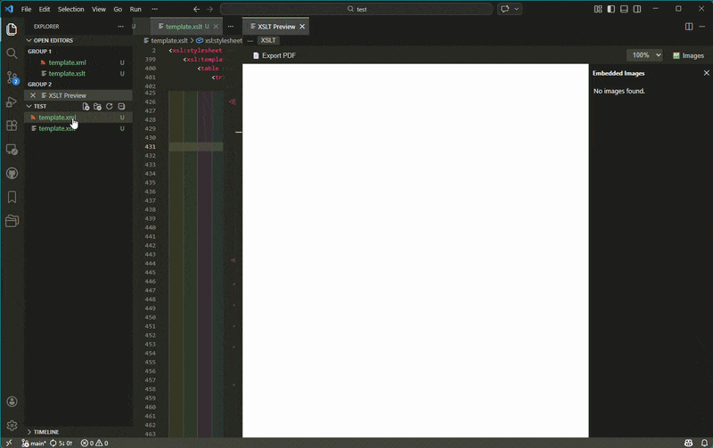
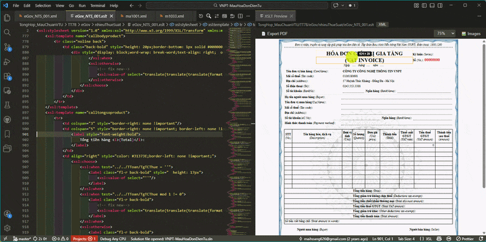
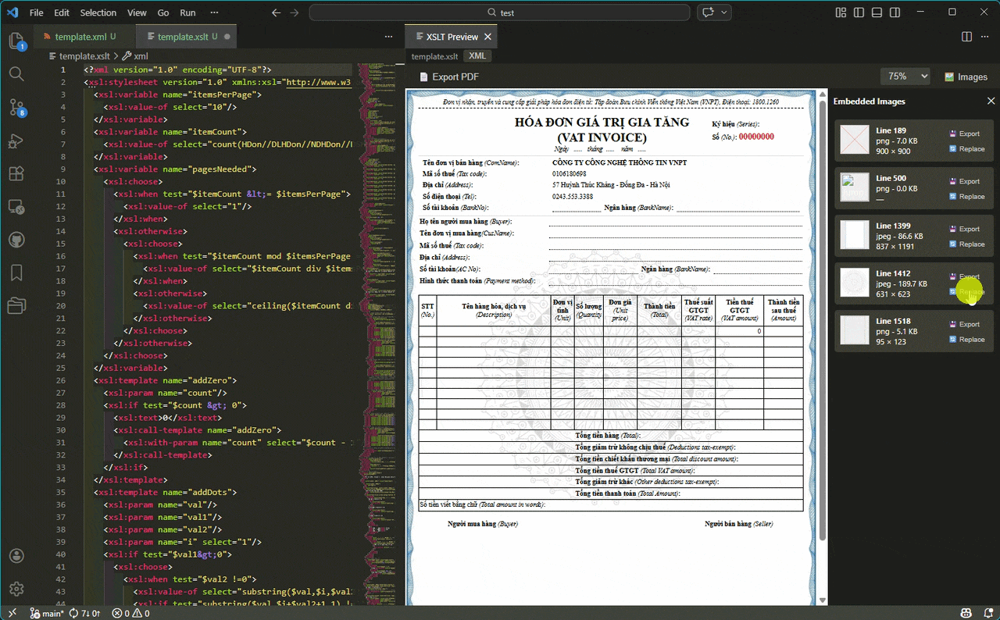

# XSLT Viewer: Live Preview & Format

> **Transform XML with XSLT and see the result instantly — right inside VS Code.**



---

## ✨ Top Features

- **Live preview** — render your XML + XSLT output in a side panel, no browser needed
- **Click-to-jump** — click any element in the preview to jump straight to the XSLT line that produced it
- **Image manager** — view, export, and swap base64-embedded images in one click
- **Formatter** — auto-format XML & XSLT with configurable indent size

### ⚡ Click-to-Jump: the magic workflow

Spot something wrong in the preview? **Click it.** VS Code jumps to the exact XSLT template responsible. No searching, no guessing.



### 📁 Embedded Image Manager

Replace logos and backgrounds without touching raw base64 strings.



---

## 🚀 Quick Start

> XSLT transformations run via **Python 3 + lxml**. The steps below take under 2 minutes.

**1. Install Python 3** — [python.org/downloads](https://www.python.org/downloads/) (check *"Add to PATH"* during setup)

**2. Install lxml:**
```bash
pip install lxml
```

**3. Verify inside VS Code** — open the Command Palette (`Ctrl+Shift+P`) and run:
```
XSLT Viewer: Check Python & lxml Setup
```
The setup page detects your environment and shows exactly what to do if anything is missing.

> Export any preview to a browser or PDF via the toolbar button inside the preview panel.
